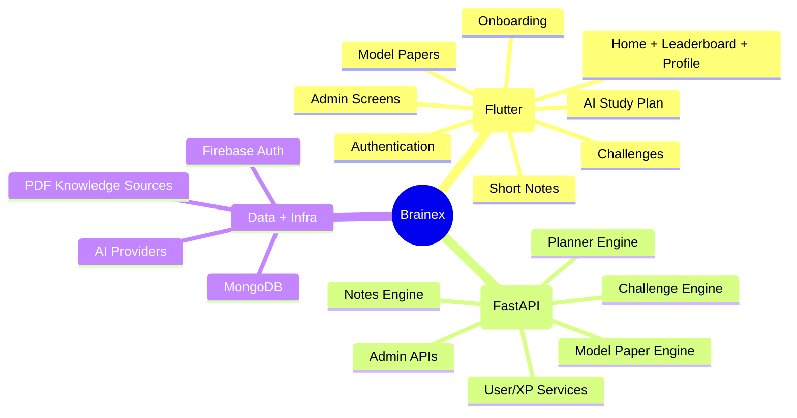
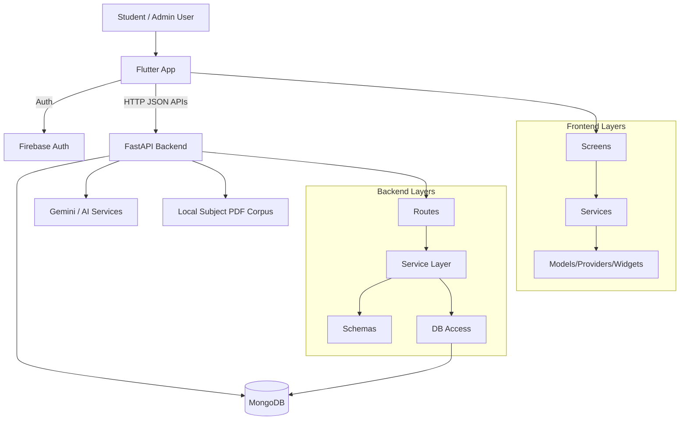
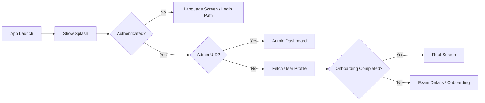
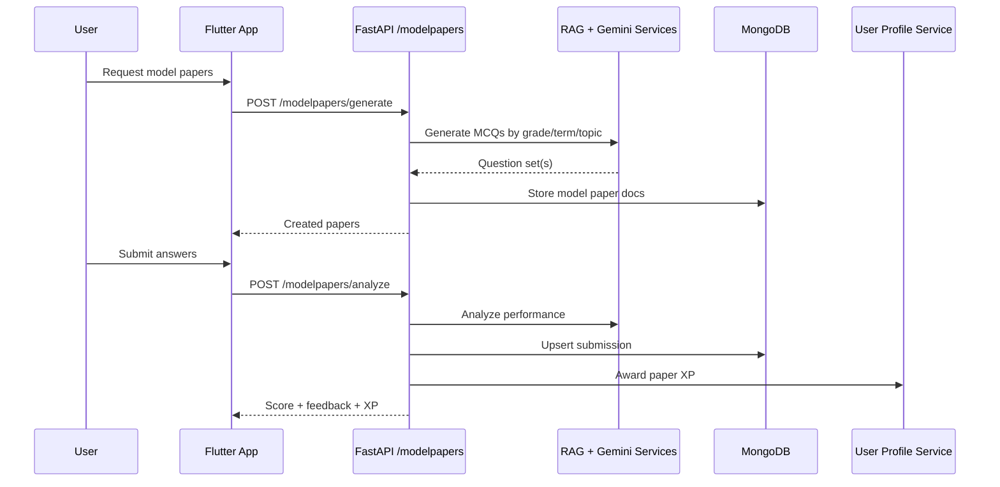
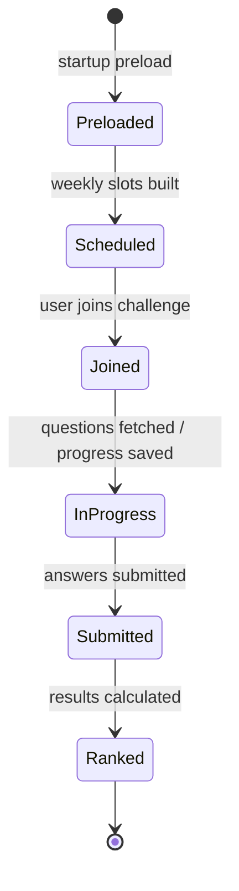
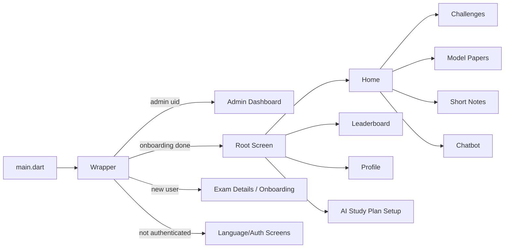
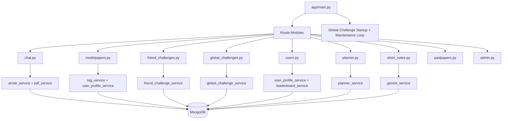
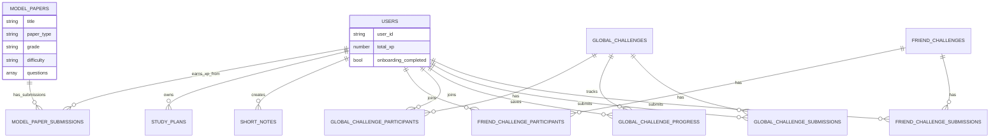
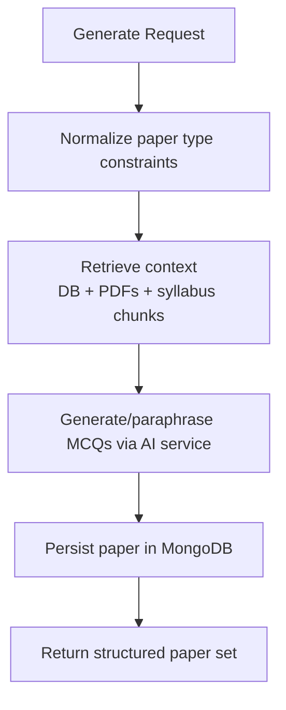
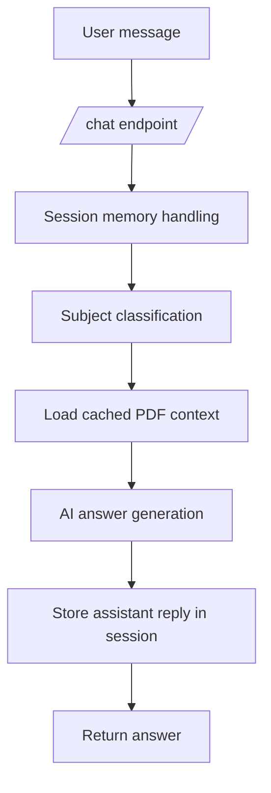

# 🧠 Brainex — AI-Powered Learning Platform

Brainex is a full-stack learning platform that combines a **Flutter mobile app** with a **FastAPI backend**, powered by **MongoDB**, **Firebase Auth**, and **AI-driven study workflows**.

---

## 📚 Table of Contents

- [1) Product Snapshot](#1-product-snapshot)
- [2) Visual System Architecture](#2-visual-system-architecture)
- [3) End-to-End User Flows](#3-end-to-end-user-flows)
- [4) Repository Blueprint](#4-repository-blueprint)
- [5) Frontend Architecture (Flutter)](#5-frontend-architecture-flutter)
- [6) Backend Architecture (FastAPI)](#6-backend-architecture-fastapi)
- [7) API Surface Map](#7-api-surface-map)
- [8) Data Layer & Collections](#8-data-layer--collections)
- [9) AI & Content Pipelines](#9-ai--content-pipelines)
- [10) Local Setup & Run Guide](#10-local-setup--run-guide)
- [11) Environment & Configuration](#11-environment--configuration)
- [12) Operational Notes](#12-operational-notes)

---

## 1) Product Snapshot

### Core capabilities
- 🔐 Authentication via Firebase (email/password, Google, anonymous testing)
- 👤 Onboarding + user profile + XP progression
- 🏠 Home dashboard, leaderboard, profile
- 📝 AI model paper generation + performance analysis
- 📅 AI study plan generation and retrieval
- 🤝 Friend challenges (join, start, submit, results)
- 🌍 Global weekly challenges with schedule/progress/results
- 📒 Short note generation + storage + predefined notes
- 🛠️ Admin portal (stats, user controls, notes/papers utilities)

### High-level product map



---

## 2) Visual System Architecture



---

## 3) End-to-End User Flows

### App entry flow (wrapper-driven)



### Model paper lifecycle



### Global challenge lifecycle



---

## 4) Repository Blueprint

```text
Brainex/
├── backend/
│   ├── app/
│   │   ├── core/                # settings and configuration
│   │   ├── db/                  # Mongo client + collection handles
│   │   ├── routes/              # FastAPI endpoint modules
│   │   ├── schemas/             # request/response Pydantic schemas
│   │   ├── services/            # business + AI + scoring logic
│   │   └── main.py              # FastAPI app bootstrap + router wiring
│   ├── scripts/                 # DB utility scripts
│   ├── requirements.txt
│   └── .env                     # local runtime secrets/config (not committed)
├── frontend/
│   ├── lib/
│   │   ├── screens/             # feature screens and UI flows
│   │   ├── services/            # backend communication + platform services
│   │   ├── models/              # domain models
│   │   ├── providers/           # app state providers (locale)
│   │   ├── widgets/             # reusable visual components
│   │   └── main.dart            # Flutter bootstrap
│   ├── assets/                  # images + localization assets
│   └── pubspec.yaml             # Flutter dependencies/config
└── docs/
    ├── api-contract/
    └── database/
```

---

## 5) Frontend Architecture (Flutter)

### Frontend module map



### Key frontend domains

| Domain | Main files |
|---|---|
| Bootstrap & shell | `lib/main.dart`, `lib/screens/wrapper.dart`, `lib/screens/root_screen.dart` |
| Authentication | `lib/services/auth.dart`, `lib/screens/authentication/*` |
| Study planning | `lib/screens/ai_studyplan/*`, `lib/services/study_plan_service.dart` |
| Model papers | `lib/screens/papers/*`, related service calls to `/modelpapers` |
| Challenges | `lib/screens/activity_challenges/*` |
| Short notes | `lib/screens/shortnote_page/short_notes_page.dart`, `lib/services/short_notes_service.dart` |
| Leaderboard/profile | `lib/screens/leaderboard/*`, `lib/screens/profile screen/*`, `lib/services/user_profile_service.dart` |
| Admin | `lib/screens/admin_*`, `lib/services/admin_service.dart` |
| Localization | `lib/providers/locale_provider.dart`, `lib/services/localization_service.dart`, `assets/lang/*` |

---

## 6) Backend Architecture (FastAPI)

### Backend execution map



### Backend layers
- **Routes (`app/routes`)**: HTTP endpoints and request handling
- **Services (`app/services`)**: domain logic, AI orchestration, scoring/XP
- **Schemas (`app/schemas`)**: typed contracts for payload validation
- **DB (`app/db/mongo.py`)**: shared Mongo collection handles
- **Core (`app/core/config.py`)**: environment-driven settings

---

## 7) API Surface Map

> Implemented route groups currently wired by `app/main.py`.

| Domain | Base path | Representative endpoints |
|---|---|---|
| Chat | *(no prefix)* | `POST /chat`, `POST /chat/clear` |
| Model Papers | `/modelpapers` | `POST /generate`, `GET /`, `GET /{paper_id}`, `POST /analyze` |
| Friend Challenges | `/friend-challenges` | `POST /`, `GET /{id}`, `POST /{id}/join`, `POST /{id}/start`, `GET /{id}/questions`, `POST /{id}/submit`, `GET /{id}/results` |
| Global Challenges | `/global-challenges` | `POST /preload`, `GET /schedule`, `POST /{id}/join`, `GET /{id}/questions`, `POST /{id}/progress`, `POST /{id}/submit`, `GET /{id}/results` |
| Users & XP | `/users` | `GET /leaderboard/global`, `GET /leaderboard/me`, `GET /{user_id}`, `POST /{user_id}/login`, `PUT /{user_id}/onboarding`, `PATCH /{user_id}/profile` |
| Study Planner | `/planner` | `POST /generate-and-save`, `GET /user/{user_id}`, `GET /{plan_id}` |
| Short Notes | `/short_notes` | `POST /generate`, `POST /{user_uid}`, `GET /predefined/all`, `GET /{user_uid}`, `DELETE /{user_uid}/{note_id}` |
| Past Papers | `/pastpapers` | `GET /`, `GET /{year_val}`, `POST /generate` |
| Admin | `/admin` | `GET /stats`, `GET /short_notes`, `GET /users`, `PUT /users/{user_id}/status` |

---

## 8) Data Layer & Collections

### Mongo collection map (`app/db/mongo.py`)



### Primary collections in use
- `users`
- `model_papers`, `model_paper_submissions`
- `study_plans`
- `short_notes`, `predefined_notes`
- `friend_challenges`, `friend_challenge_participants`, `friend_challenge_submissions`
- `global_challenges`, `global_challenge_participants`, `global_challenge_progress`, `global_challenge_submissions`
- `papers`, `mcq_bank`, `syllabus_chunks`

---

## 9) AI & Content Pipelines

### Model paper generation pipeline



### Study assistance/chat pipeline



---

## 10) Local Setup & Run Guide

### Backend

```bash
cd /home/runner/work/Brainex/Brainex/backend
python -m venv .venv
source .venv/bin/activate   # On Windows: .venv\Scripts\activate
pip install -r requirements.txt
uvicorn app.main:app --reload --host 0.0.0.0 --port 8000
```

### Frontend

```bash
cd /home/runner/work/Brainex/Brainex/frontend
flutter pub get
flutter run
```

### Base URL behavior (frontend)
- Android emulator default: `http://10.0.2.2:8000`
- iOS/web/local desktop default: `http://127.0.0.1:8000`

---

## 11) Environment & Configuration

Backend settings (`backend/app/core/config.py`) are environment-driven:

| Variable | Purpose |
|---|---|
| `MONGO_URI` | MongoDB connection URI |
| `DB_NAME` | Database name (default `brainex`) |
| `GEMINI_API_KEY` | Key for AI generation services |
| `GEMINI_MODEL` | Gemini model name (default `gemini-1.5-flash`) |
| `openrouter_api_key` | Optional OpenRouter key |
| `github_token` | Optional token |

> Keep secrets in local `.env` and never commit them.

---

## 12) Operational Notes

- Global challenges are preloaded and maintained on backend startup.
- User XP is awarded from multiple flows (daily login, model paper completion, challenge outcomes).
- Frontend contains both learner and admin experiences in one app shell.
- Existing docs are available under `/docs` and can be expanded into deeper architecture references.

---

If you want, the next step can be a **diagram-first API handbook** under `docs/` where each domain gets request/response examples and sequence diagrams.
